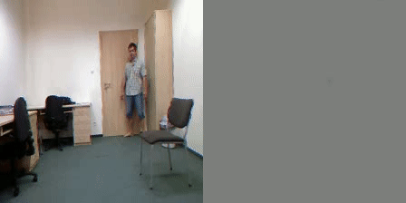

# denseflow-python

DenseFlow python implementation based on OpenCV's TV-L1 optical flow implementation and https://github.com/yjxiong/dense_flow.

<p align="center">
    
</p>

# Prerequisite
```bash
pip install opencv-python opencv-contrib-python numpy tqdm
```

# How to run DenseFlow example
```bash
python example.py
```
# Reference
- [URFD](http://fenix.univ.rzeszow.pl/~mkepski/ds/uf.html)
